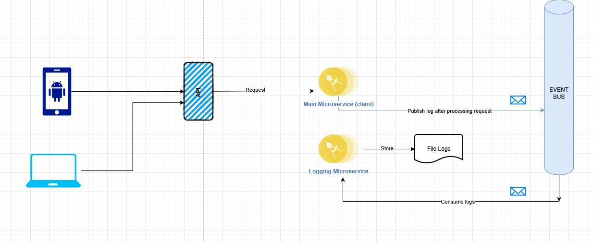

# Microservices

We have two simple microservices: the **Logging Microservice**, which remains on standby to receive incoming logs continuously, and another microservice named **AlphaService** (or **MainService**).



The user makes an HTTP request to the **Main Service**, which simulates some processing and then logs the result based on the GET parameter `simulate` (`success`, `info`, `warning`, `fatal`). The log is then published based on its level, and the **Logging Microservice** intercepts the message and eventually logs it into a file.

## Detailed Process

### Example 1: Success Simulation

1. **User Request:**
   ```bash
   GET [MainService]/api/main/process?simulate=success
   ```
   
2. **Response:**
   ```json
   {
     "message": "Microservice (Main) processed the request successfully",
     "id": "8ef349e1-a415-4b8e-addd-6b83d2c322dd"
   }
   ```

### Example 2: Warning Simulation

1. **User Request:**
   ```bash
   GET [MainService]/api/main/process?simulate=warning
   ```
   
2. **Response:**
   ```json
   {
     "message": "Microservice (Main) raised a warning",
     "id": "8ef349e1-a415-4b8e-addd-6b83d2c322dd"
   }
   ```


## Starting RabbitMQ Server

Using Docker, it's simple to start the RabbitMQ server:

1. Pull and run the RabbitMQ container using the command:
   ```bash
   docker run -it --rm --name myrabbitmq -p 5672:5672 -p 15672:15672 rabbitmq:3-management
   ```

That would be it for the server.


## Building and Running the Microservices

### Logging Microservice

Build and run the Logging Microservice:


### Main Microservice

Build and run the Main Microservice:


When the Main Microservice starts, it sends a log indicating that the server is up.

After running a few tests at various levels, the logs are received directly.


